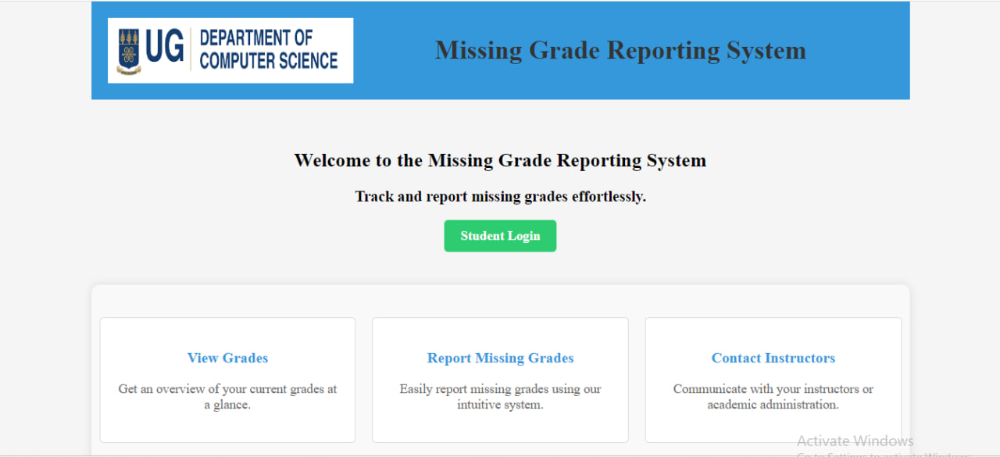
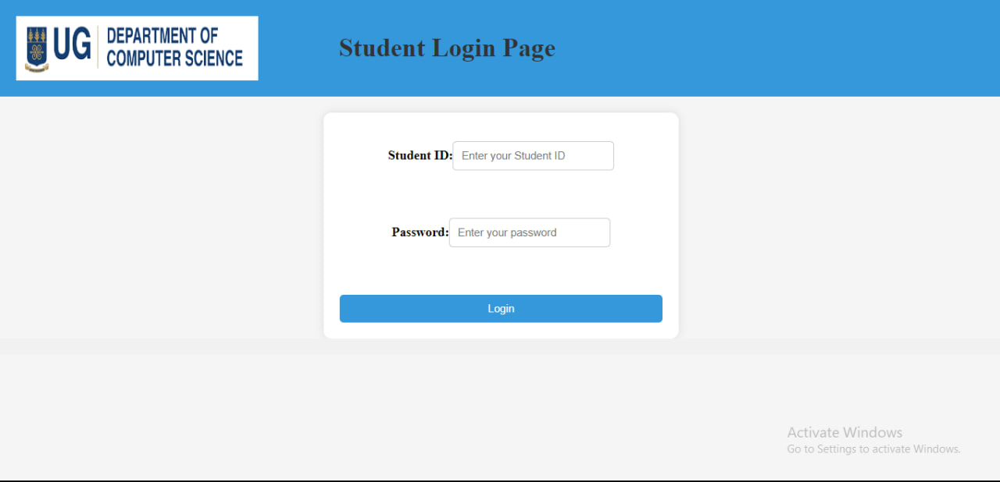
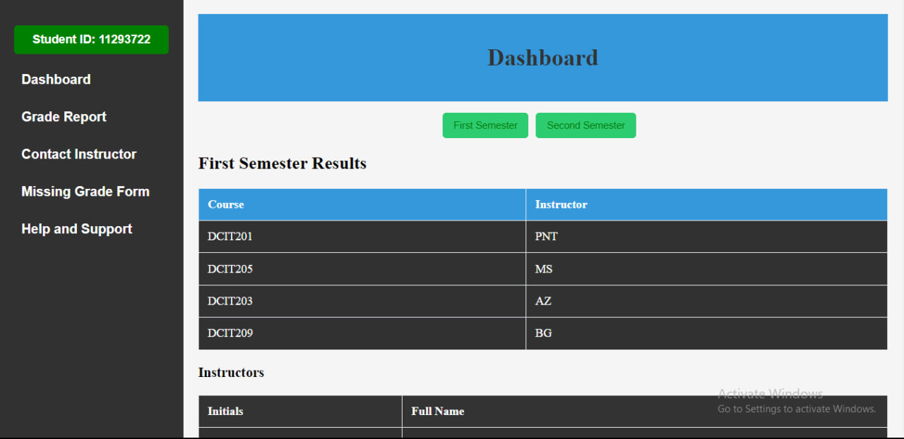
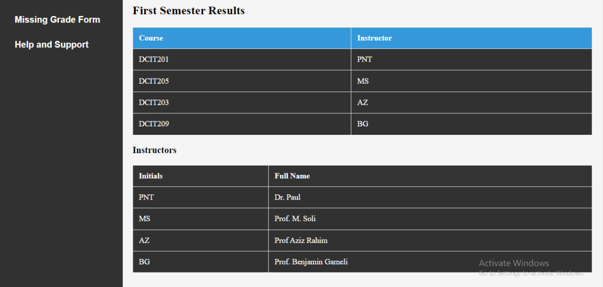
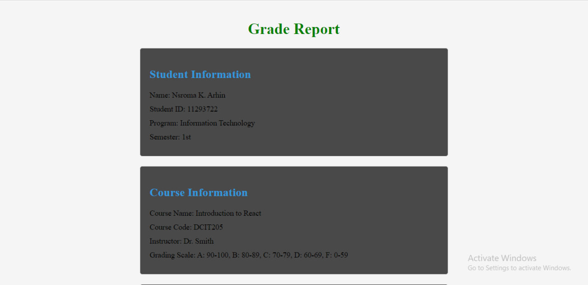
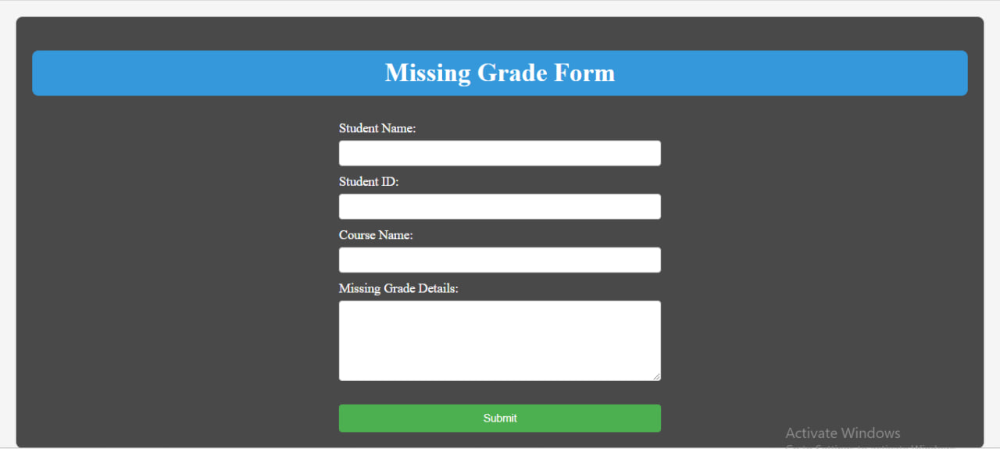

# Student Grade Reporting System Frontend

## Student Details
11293722
Nsroma Kweku Nsarko Arhin 

## Project Overview

This project is a front-end web application for a Student Grade Reporting System. It simulates a real-world application where students can view, report, and manage their academic grades. This system addresses the issue of missing or unrecorded grades in a student's profile.

## Application Structure

The application consists of 7 main pages:

- **Homepage:** Introduction to the system and its purpose.
- **Login Page:** Mock login interface for student authentication.
- **Dashboard:** Displays an overview of the student’s current grades and alerts for missing grades.
- **Grade Report:** Shows a detailed view of the student's grades filtered by semester or academic year.
- **Missing Grade Form:** Enables students to report missing grades.
- **Instructor Contact Page:** Lists instructors' contact information with a simulated email feature.
- **Help and Support:** Provides FAQs and a mock support contact form.


## Setup and Installation

To set up the project locally, follow these steps:

```bash
git clone https://github.com/KTTfx/Frontend-Grading-Assignment
cd frontend-grading
npm install
npm start
```

This will start the application on `localhost` at the default port.

## Contribution

To contribute to this project, please follow these guidelines:

1. Fork the repository.
2. Create a new branch for your feature.
3. Commit your changes and push them to your branch.
4. Submit a pull request for review.

## Screenshots









