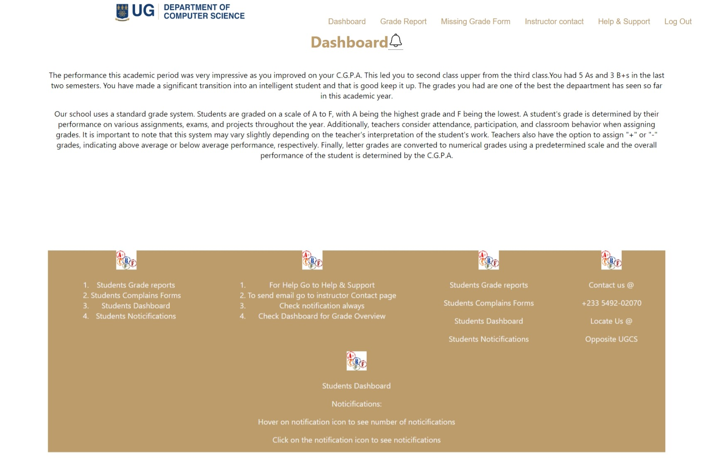
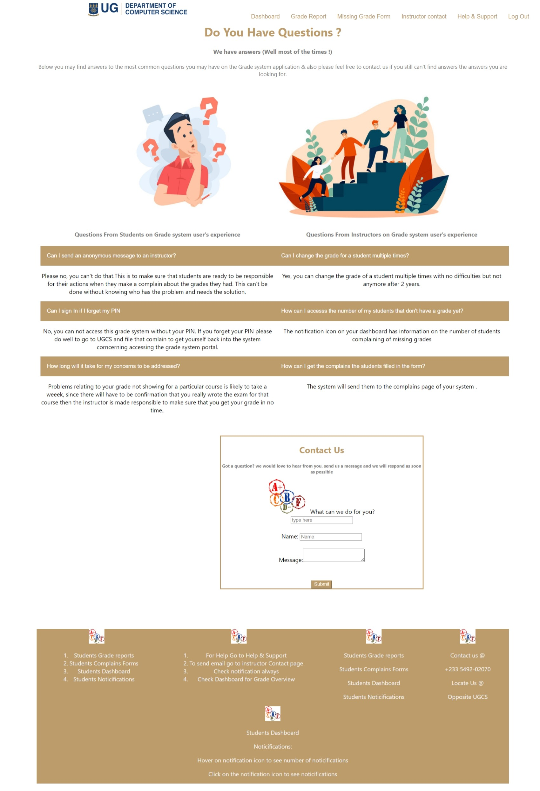
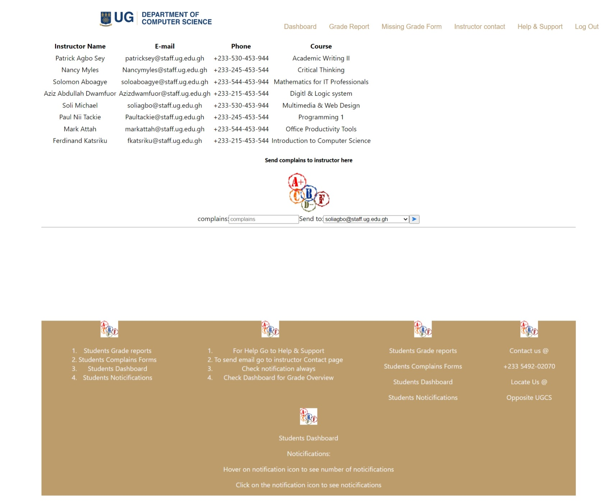
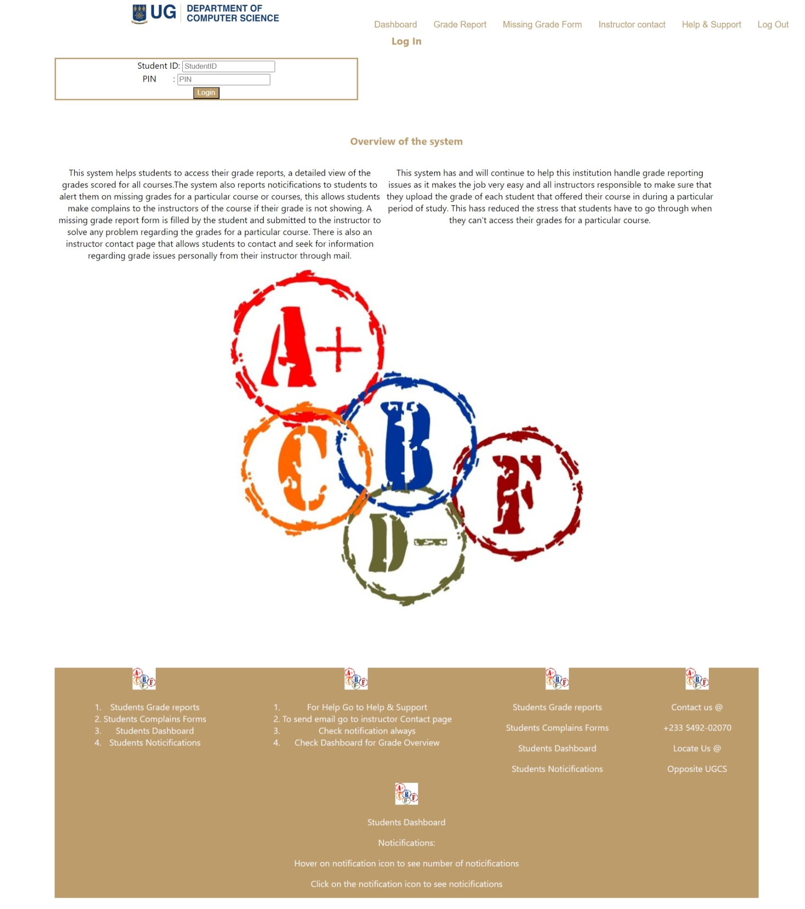
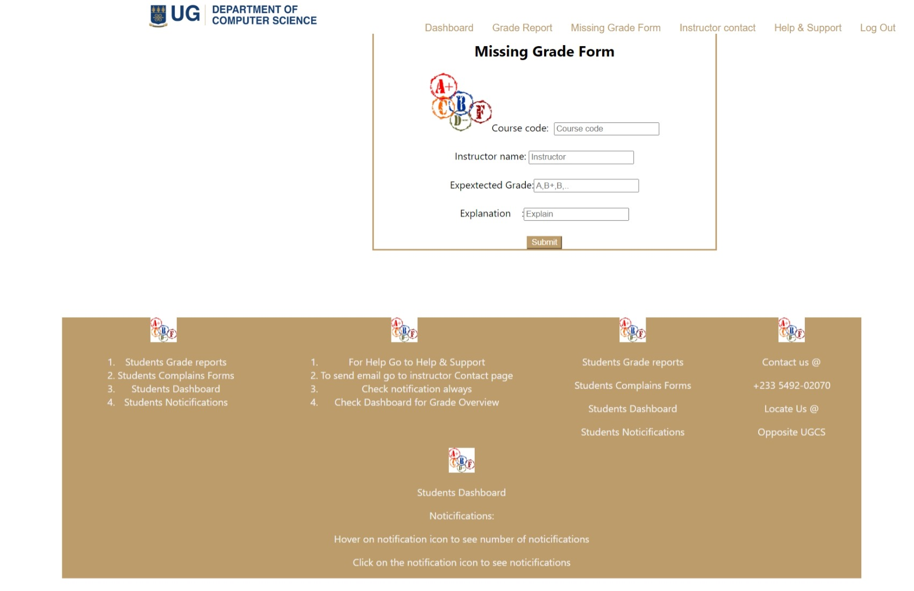
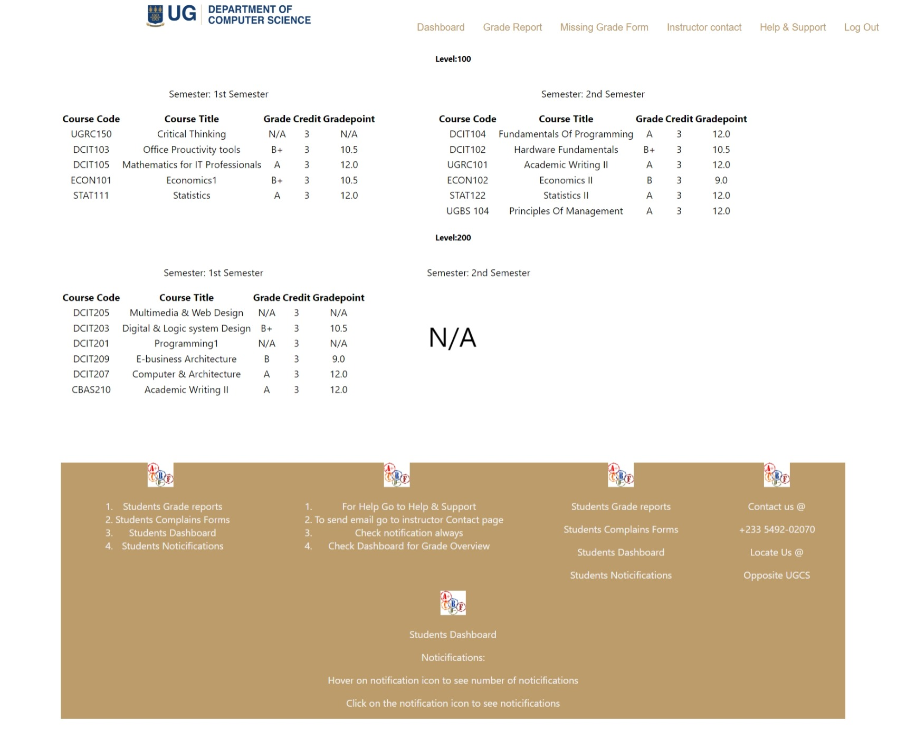

# Student Grade Reporting System Frontend

## Project Overview

This project is a front-end web application for a Student Grade Reporting System. It simulates a real-world application where students can view, report, and manage their academic grades. This system addresses the issue of missing or unrecorded grades in a student's profile.
## Personal Details
Name: Akoto Boadi 
ID: 11255826
## Application Structure

The application consists of 7 main pages:

- **Homepage:** Introduction to the system and its purpose.
- **Login Page:** Mock login interface for student authentication.
- **Dashboard:** Displays an overview of the student’s current grades and alerts for missing grades.
- **Grade Report:** Shows a detailed view of the student's grades filtered by semester or academic year.
- **Missing Grade Form:** Enables students to report missing grades.
- **Instructor Contact Page:** Lists instructors' contact information with a simulated email feature.
- **Help and Support:** Provides FAQs and a mock support contact form.

## Technical Details

- **Framework/Technology Used:** [React]
- **Responsive Design:** Implemented using [CSS Flexbox/Grid, Bootstrap, Tailwind CSS].
- **JavaScript Functionality:** Used for form validations, dynamic content rendering, and simulating interactions.

## Setup and Installation

To set up the project locally, follow these steps:

```bash
git clone https://github.com/your-github-username/DCIT_205_ASSIGNGMENT1.git
cd repo-name
npm install
npm start
```

This will start the application on `localhost` at the default port.

## Usage
4. Open your web browser and navigate to http://localhost:3000 to access the application.

5. Login using your Student ID and PIN on the Login page.

6. Once logged in, you will be redirected to the Dashboard page where you can view an overview of your current grades and any missing grade alerts.

7. To view detailed information about your grades, navigate to the Grade Report page. You can filter the grades by semester or academic year.

8. To report a missing grade, go to the Missing Grade Form page and fill in the required fields: course name, instructor name, expected grade, and an explanation for the missing grade. Submit the form to receive a confirmation message.
9. For contacting instructors, visit the Instructor Contact page to find a list of instructors along with their contact details. You can also send a simulated email to the instructor.
10. The grade report page renders that of a level 200 student who just completed first semester so all other levels are unavailable.


## Contribution

To contribute to this project, please follow these guidelines:

1. Fork the repository.
2. Create a new branch for your feature.
3. Commit your changes and push them to your branch.
4. Submit a pull request for review.

## Screenshot of pages






# Challenges I faced 
I faced a lot of difficulties while doing the work, I was not able to run my codes on the local host server at a point but did not give up checked out some remedies for thaat problem online and fixed it. I was also facing difficulties on how to use the react router but was able to get resources online from w3 schools and other websites to helpm me understand how it works. 
I was finding it very difficult to filter the grade report page by semester and level.
# Lessons learned 
I have learnt a lot of things through out this project some include;
1. How to use react to create a collapbsible set
2. How to use CSS in react 
3. How to use inline styling in react 
4. How to add functionality to events like clicking 
5. How to make a component be rendered on all the pages of the website  