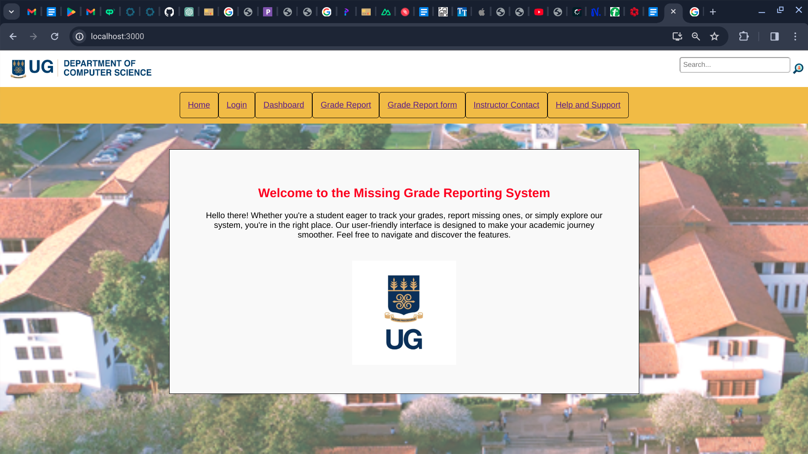
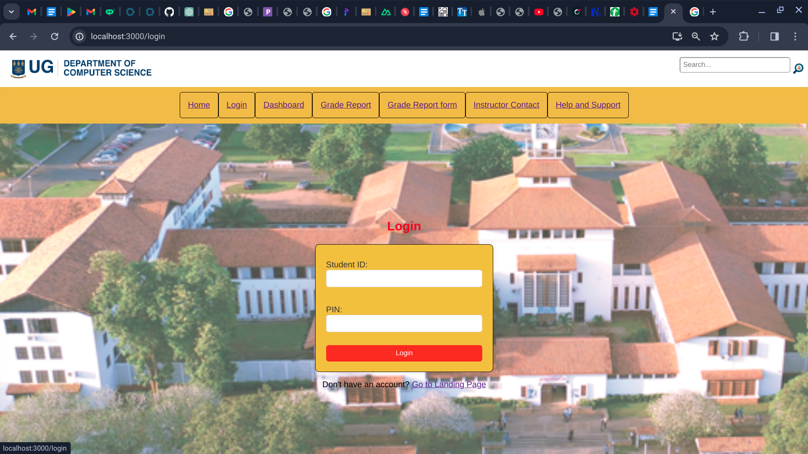
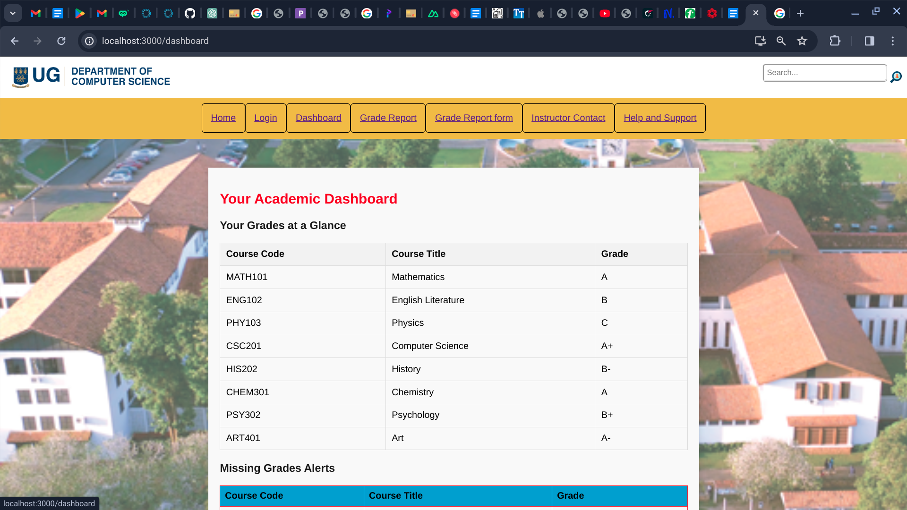
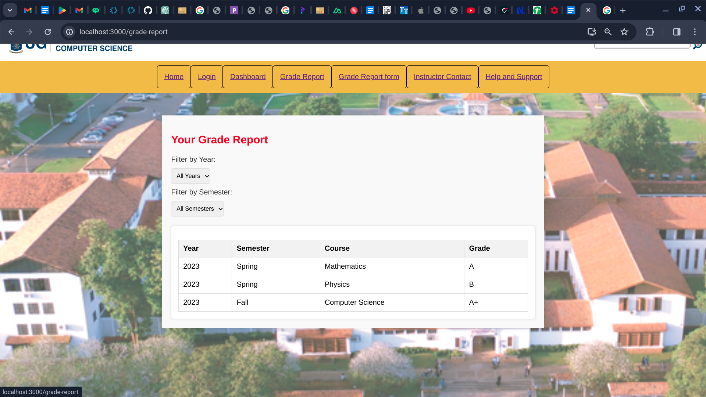
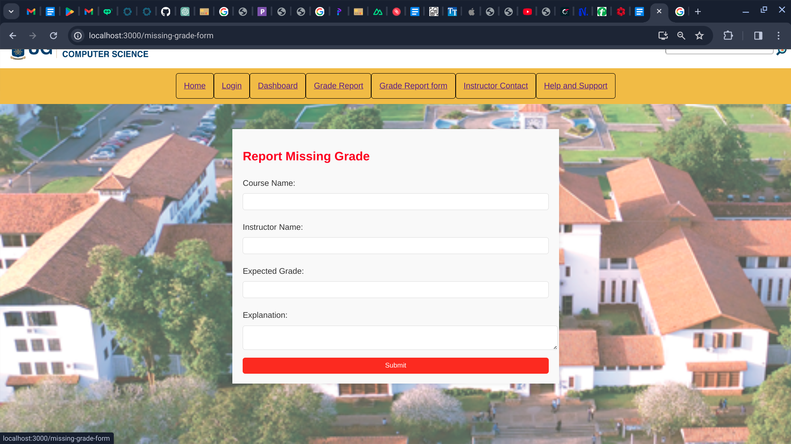
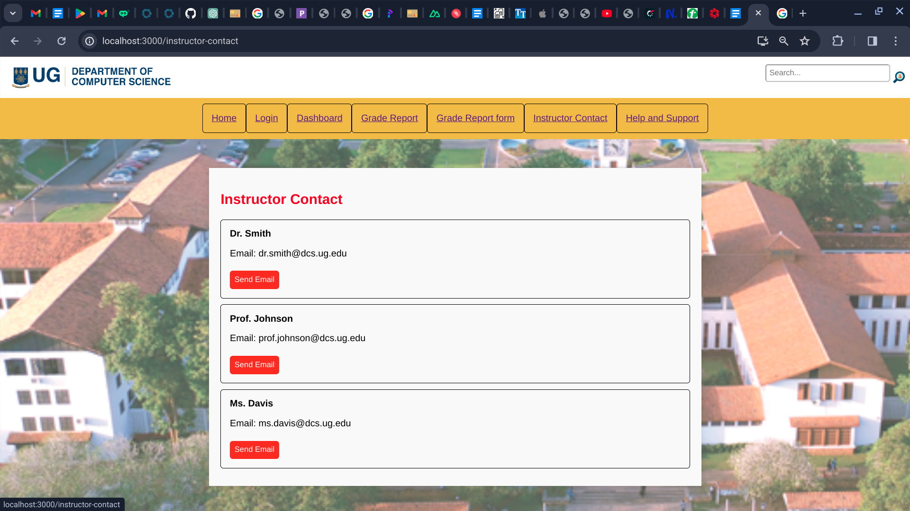
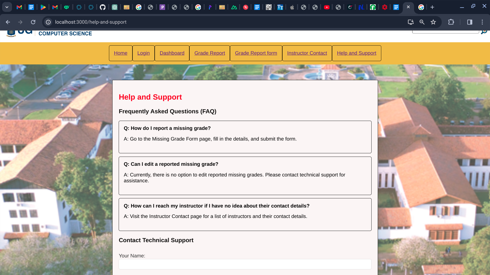

# Missing Grade Reporting System

Welcome to the Missing Grade Reporting System! This web application provides students with an interactive platform to track and report missing grades.

## Table of Contents

- [Features](#features)
- [Screenshots](#screenshots)
- [Technologies Used](#technologies-used)
- [Getting Started](#getting-started)
- [Folder Structure](#folder-structure)
- [Contributing](#contributing)
- [License](#license)

## Features

- View current grades
- Report missing grades
- Contact instructors
- Explore a user-friendly dashboard
- Frequently asked section to see most asked question for a particular criterea

## Screenshots

Include screenshots of each page in the "screenshots" folder.

- Landing Page
  

- Login Page
  

- Dashboard Page
  

- Grade Report Page
  

- Missing Grade Form Page
  

- Instructor Contact Page
  

- Help and Support Page
  

## Technologies Used

- React
- CSS/Bootstrap/Tailwind
- Vite (optional)

## Getting Started

1. Clone the repository.
2. Install dependencies: `npm install`
3. Run the application: `npm start`

## Folder Structure
src/
|-- components
|-- pages
|-- screenshots

