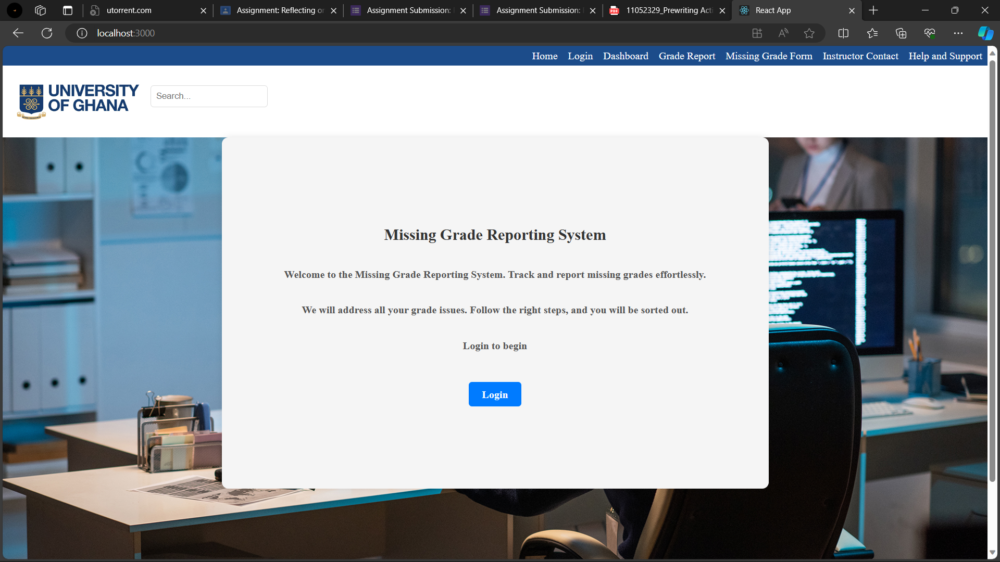
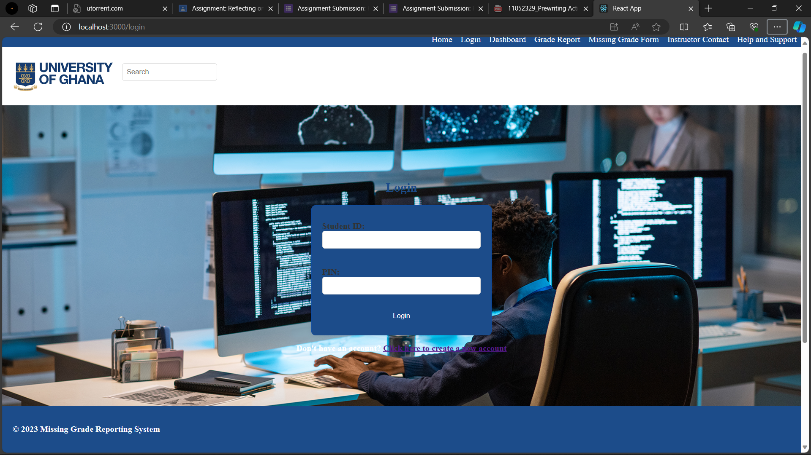
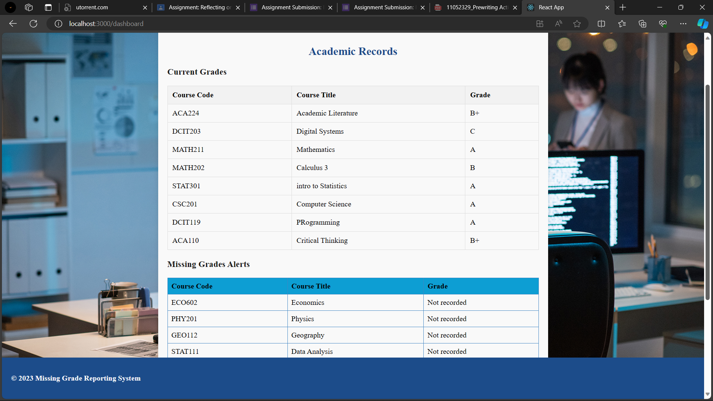
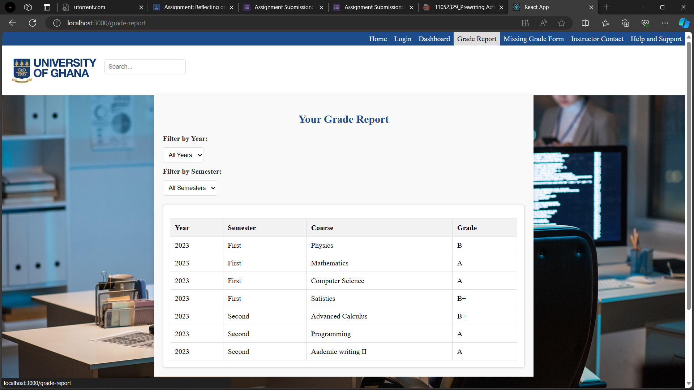
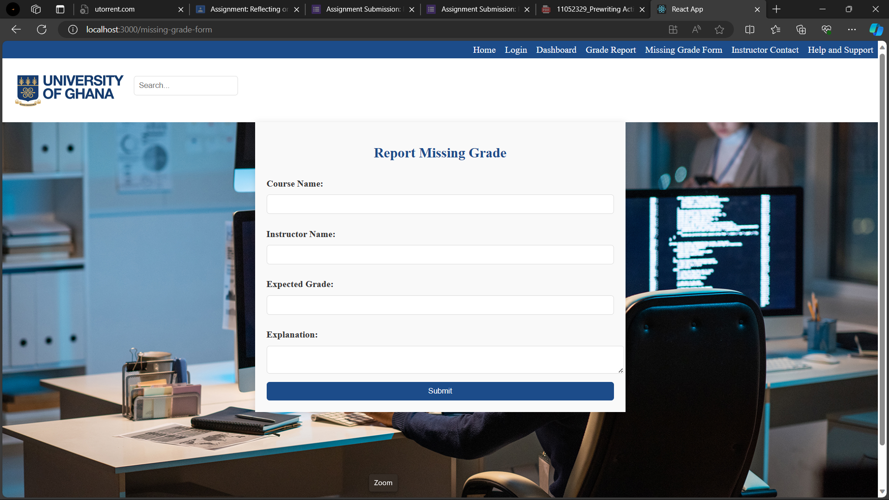
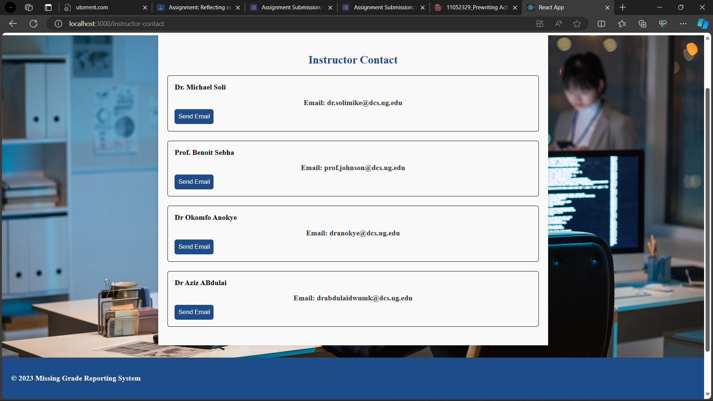
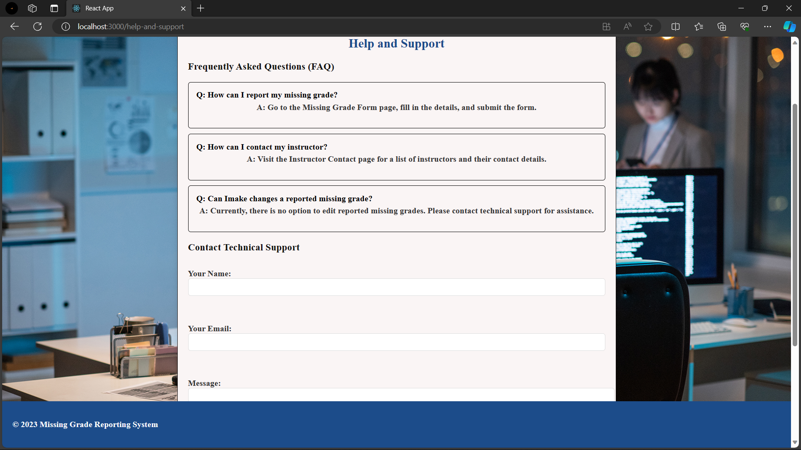

# Missing Grade Reporting System

The Missing Grade Reporting System is a web application designed to help students track and report grades that are not recorded in their academic profiles. It provides an interactive, user-friendly interface for viewing grades, reporting missing grades, and communicating with instructors or academic administration.

## Features

- **Responsive Design:** The website is designed to be accessible on various devices.
- **User Authentication:** Secure login system using Student ID and PIN.
- **Dashboard:** Overview of the student's current grades with alerts for missing grades.
- **Grade Report:** Detailed view of all courses and respective grades, filterable by semester/academic year.
- **Missing Grade Form:** Form for reporting missing grades with fields for course name, instructor name, expected grade, and an explanation.
- **Instructor Contact:** List of instructors with contact details and an option to send simulated emails.
- **Help and Support:** FAQ section regarding grade reporting and a contact form for technical support.

License
This project is licensed under the MIT License.## Technologies Used

- **React:** JavaScript library for building user interfaces.
- **React Router:** Declarative routing for React.js applications.
- **node_modules:** Contains all dependencies

To be able to replicate this projects follow the steps bellow:

1. **Clone the Repository:**
   ```bash
   git clone https://github.com/Edemowns/Frontend-Grading-Assignment.git
   cd missing-grade-system
2. **Install dependencies:**
```bash```
npm install

3. **Run the Application:**
```bash``````
npm start 

## Usage

A. Logging In
1. Open the application in your web browser.
2. Navigate to the "Login" page by clicking on the "Login" link in the navigation bar.
3. Enter your Student ID and PIN in the secure login form.
4. Click the "Login" button..

B.DASHBOARD
. The dashboard displays a summary of your grades.
. Any missing grades are highlighted with alerts or notifications.

C. Grade Report
Access Grade Report:

Click on the "Grade Report" link in the navigation bar to view a detailed report of all your courses and grades.
Optionally, use filters to view grades by semester or academic year.
Viewing Grades:

The Grade Report page presents a list of courses along with their respective grades.
Explore your academic performance across different semesters.
D. Missing Grade Form
Report a Missing Grade:
To report a missing grade, navigate to the "Missing Grade Form" page using the navigation bar.
Fill out the form with the required information:
Course name
Instructor name
Expected grade
Explanation for the missing grade
Click the "Submit" button to report the missing grade.

E. Instructor Contact
Contacting Instructors:
Visit the "Instructor Contact" page to access a list of instructors along with their contact details.
Simulate sending an email to an instructor by clicking on the provided email links.

F. Help and Support
FAQ and Support:
Explore the "Help and Support" page for frequently asked questions related to grade reporting.
Use the contact form to reach out for technical support if needed.

## Contributing
If you'd like to contribute to this project, please follow the guidelines in the CONTRIBUTING.md file.
## License
This project is licensed under the University of Ghana License.

For questions or support, please contact Nyanyo Edem Larry at 2000larryk@gmail.com

Images 0f the website are displayed below :
## Screenshots

### Landing



### Login



### Dashboard



### Grade Report



### Missing Grade Form



### Instructor Contact



### Help and Support


