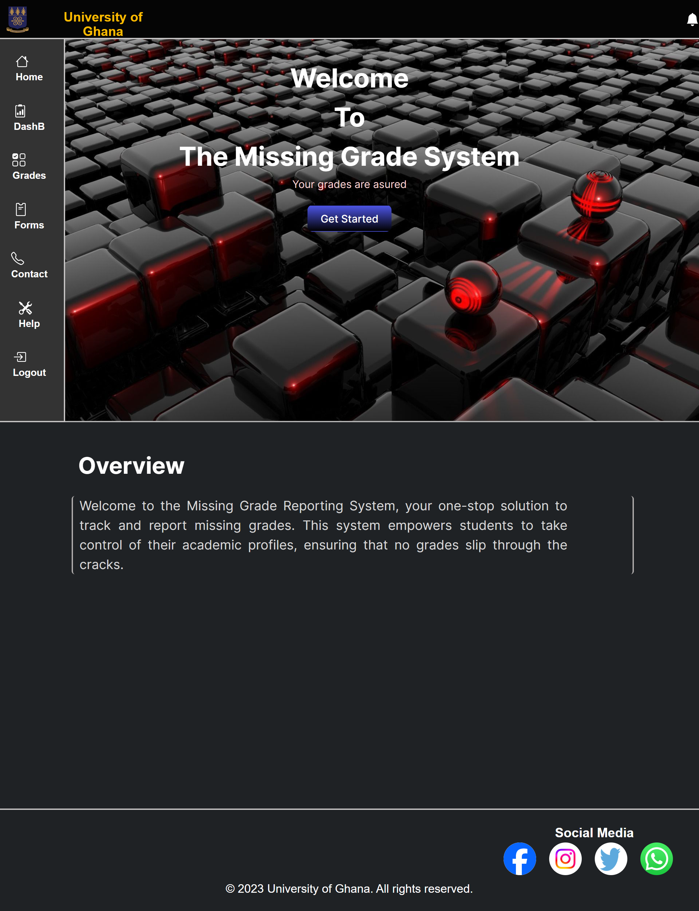
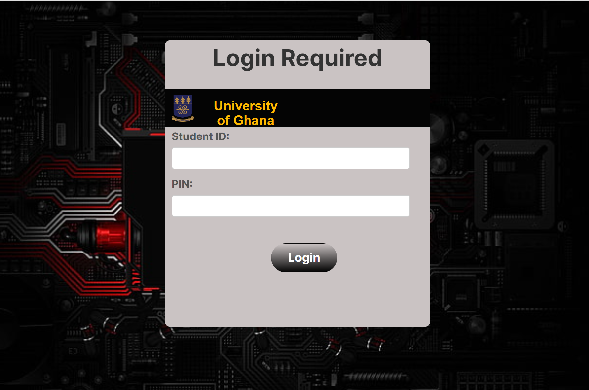
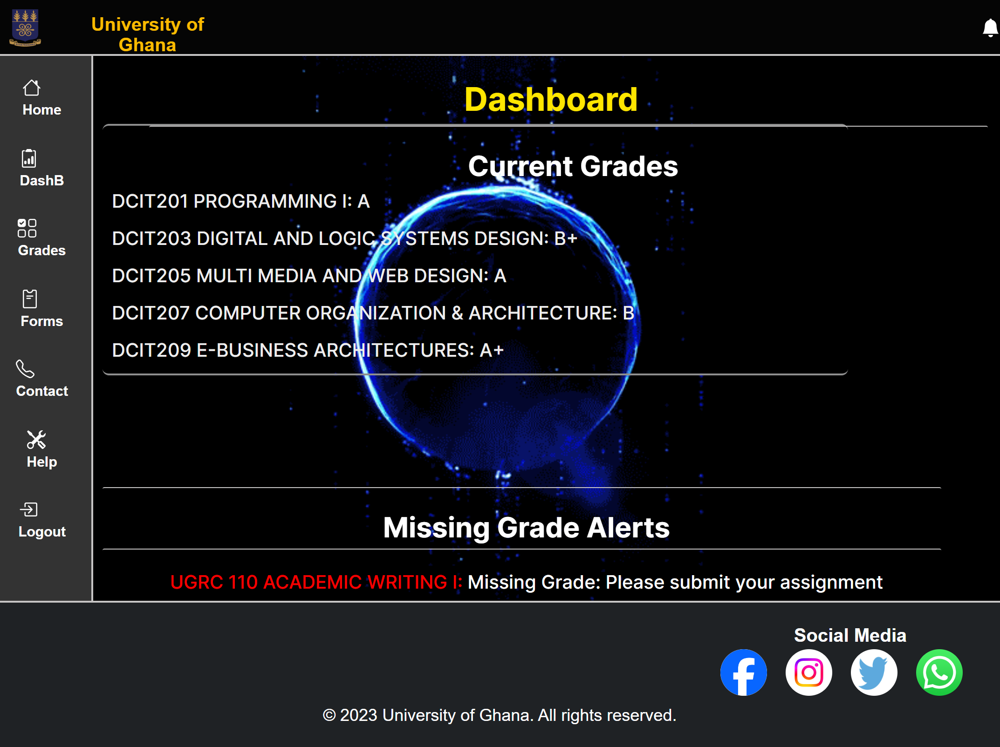
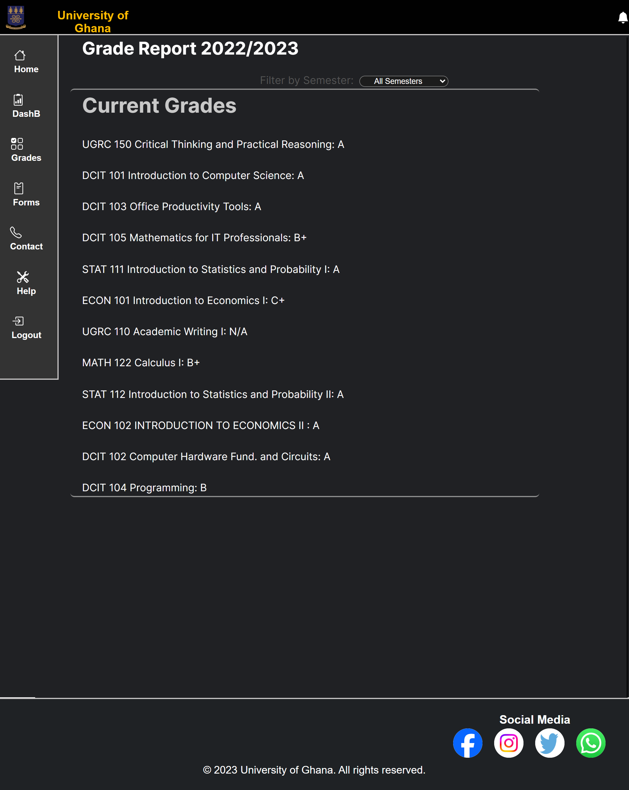
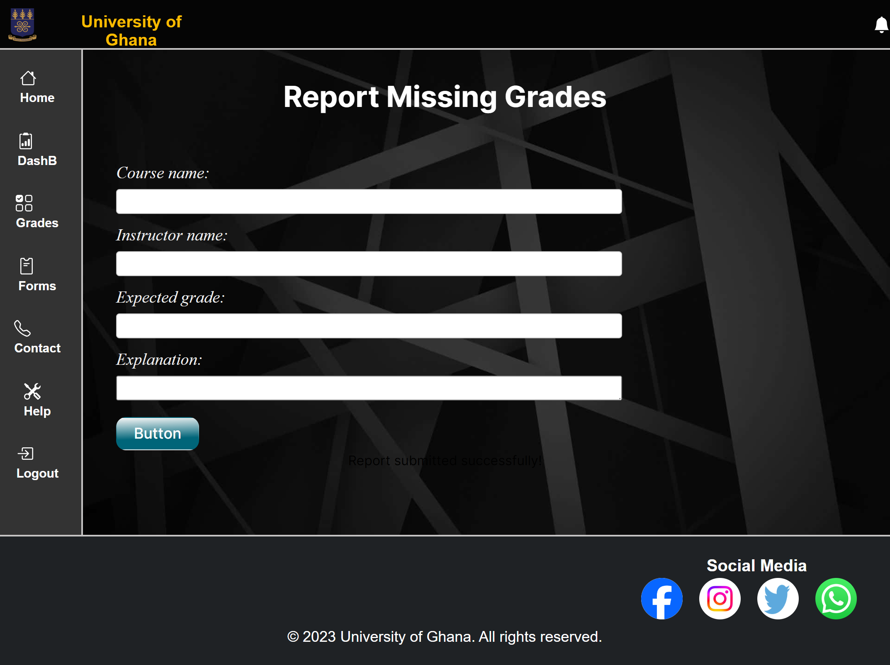
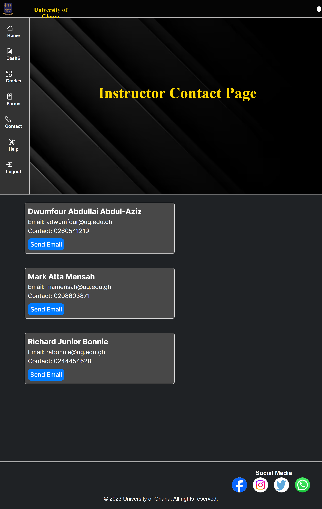
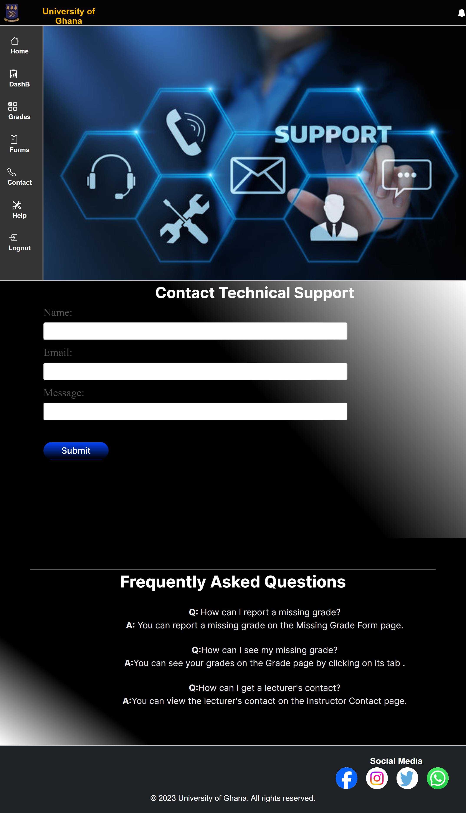

# Student Grade Reporting System Frontend

## Project Overview

This project is a front-end web application for a Student Grade Reporting System. It simulates a real-world application where students can view, report, and manage their academic grades. This system addresses the issue of missing or unrecorded grades in a student's profile.

## Application Structure

The application consists of 7 main pages:

- **Homepage:** Introduction to the system and its purpose.


- **Login Page:** Mock login interface for student authentication.


- **Dashboard:** Displays an overview of the student’s current grades and alerts for missing grades.


- **Grade Report:** Shows a detailed view of the student's grades filtered by semester or academic year.


- **Missing Grade Form:** Enables students to report missing grades.


- **Instructor Contact Page:** Lists instructors' contact information with a simulated email feature.


- **Help and Support:** Provides FAQs and a mock support contact form.



## Technical Details

- **Framework/Technology Used:** [Vite]
- **Responsive Design:** Implemented using [SCSS,CSS Flexbox/Grid, Bootstrap, Tailwind CSS].
- **JavaScript Functionality:** Used for form validations, dynamic content rendering, and simulating interactions.

## Setup and Installation

To set up the project locally, follow these steps:

```bash
git clone https://github.com/your-github-username/DCIT_205_ASSIGNGMENT1.git
cd repo-name
npm install
npm start
```

This will start the application on `localhost_5173` at the default port.

## Usage

To use the "Missing Grade Reporting System" website, students should follow these steps:

1. Open the website and navigate to the login page.
2. Enter your student ID and PIN in the secure login form.
3. Once logged in, you will be directed to the landing page, which provides an overview of the system.
4. To view detailed information about your grades, navigate to the grade report page. Here, you can see a detailed view of all courses and respective grades, with an option to filter by semester.
5. To report a missing grade, navigate to the missing grade form page. Fill out the form with the course name, instructor name, expected grade, and explanation field. Then, click the submit button to report the missing grade. Please note that this is a simulated submission, and no real submission will be made.
6. To contact your instructor, navigate to the instructor contact page. Here, you can find a list of instructors with contact details. You can also send a simulated email to the instructor using the provided option. Please note that this is a simulated email, and no real email will be sent.

The website  simulate authentication and submission, so there is no real backend. The navbar/sidebar and footer  helps you navigate the website easily. If you have any technical issues, you can visit the help and support page, which has an FAQ section regarding grade reporting and a contact form for technical support. 


## Contribution

To contribute to this project, please follow these guidelines:

1. Fork the repository.
2. Create a new branch for your feature.
3. Commit your changes and push them to your branch.
4. Submit a pull request for review.

Please adhere to the project's coding standards and provide clear and detailed pull request descriptions.
