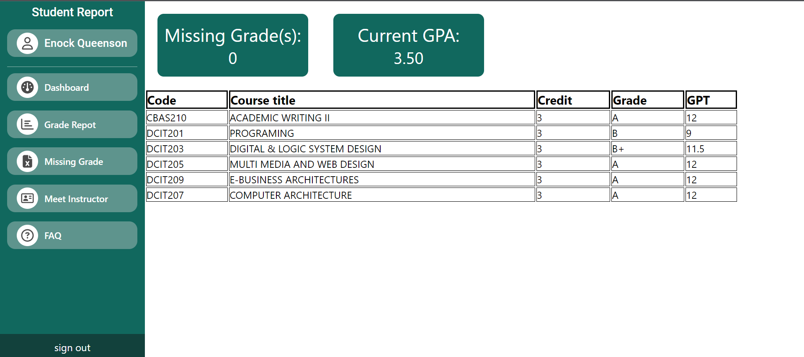
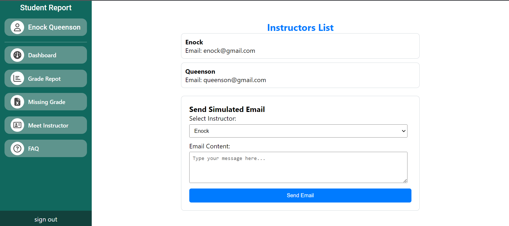

### STUDENT NAME: ENOCK QUEEENSON EDUAFO
### STUDENT ID: 11014444

## Description
This React project is designed to provide a seamless user experience for various functionalities within an educational context. The application includes the following pages:

### 1. Login Page
The Login Page serves as the entry point to the application, allowing users to securely access their accounts. Users can log in with their credentials to access personalized content and features.

### 2. Dashboard Page
The Dashboard Page provides users with an overview of essential information and key metrics related to their educational journey. It serves as a centralized hub for quick access to relevant data and functionalities.

### 3. Grade Report Page
The Grade Report Page enables users to view detailed information about their academic performance. Users can explore their grades, track progress, and gain insights into their achievements across different courses.

### 4. Missing Grade Page
The Missing Grade Page alerts users about any incomplete or missing grades. It provides a comprehensive view of outstanding assignments or assessments, helping users stay on top of their academic responsibilities.

### 5. Instructor Contact Page
The Instructor Contact Page facilitates communication between students and instructors. Users can find contact information for their instructors, making it easy to reach out for clarification, guidance, or additional support.

### 6. FAQ Page
The FAQ Page is a valuable resource for users seeking answers to common questions. It serves as a self-help guide, providing information on various topics related to the application, academic policies, and other relevant subjects.

## Getting Started
1. Clone the repository.
2. Install dependencies using npm install.
3. Run the application with npm start.

## How to Navigate the Website
- Firstly, in the login page click on Login.
- Lastly, in the dashboard try clicking all links one by one to understand how the wedsite works.

## Technologies
- React.js
- Google font(Roboto)
- Fontawesome(Icons)

