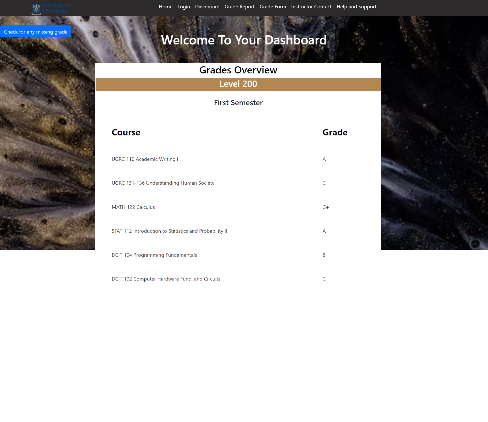

# Student Grade Reporting System Frontend

## Project Overview

This project is a front-end web application for a Student Grade Reporting System. It simulates a real-world application where students can view, report, and manage their academic grades. This system addresses the issue of missing or unrecorded grades in a student's profile.

## Application Structure

The application consists of 7 main pages:

- **Homepage:** Introduction to the system and its purpose.
- **Login Page:** Mock login interface for student authentication.
- **Dashboard:** Displays an overview of the student’s current grades and alerts for missing grades.
- **Grade Report:** Shows a detailed view of the student's grades filtered by semester or academic year.
- **Missing Grade Form:** Enables students to report missing grades.
- **Instructor Contact Page:** Lists instructors' contact information with a simulated email feature.
- **Help and Support:** Provides FAQs and a mock support contact form.

## Technical Details

- **Framework/Technology Used:** [React]
- **Responsive Design:** Implemented using [CSS Flexbox/Grid, Bootstrap, Tailwind CSS].
- **JavaScript Functionality:** Used for form validations, dynamic content rendering, and simulating interactions.

## Setup and Installation

To set up the project locally, follow these steps:

```bash
git clone https://github.com/NanaAmpomah/DCIT_205_ASSIGNGMENT1.git
cd repo-name
npm install
npm start
```

This will start the application on `localhost` at the default port.

# Screenshots

## Home


## Login


## Dashboard


## Grade Report


## Missiing Grade Form


## Instructors


## Help And Support


## Usage

To use the application,you first have to login to view your dashboard using your student ID and pin. On your dashboard, use the "check for any missing grade" button to check if there are any missing grades.If there are any missing grades,navigate to the instructors page to find the contact of your instructor and send an email or get in touch. Alternatively, you could also go to the "grade form" page and fill in the form to prompt your instructor about your missing grade. If you have problems navigating the site, do not hesitate to reach out to our experts on the "help and support" page

## Contribution

To contribute to this project, please follow these guidelines:

1. Fork the repository.
2. Create a new branch for your feature.
3. Commit your changes and push them to your branch.
4. Submit a pull request for review.

Please adhere to the project's coding standards and provide clear and detailed pull request descriptions.
