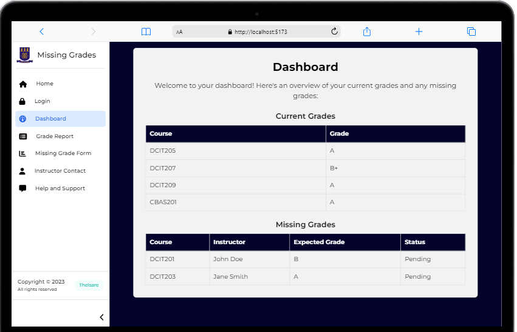

# DCIT205 ASSIGNMENT 1
## STUDENT ID: 11124414


## STUDENT GRADE REPORTING SYSTEM FRONTEND


## Project Overview

This project is a front-end web application for a Student Grade Reporting System. It simulates a real-world application where students can view, report, and manage their academic grades. This system addresses the issue of missing or unrecorded grades in a student's profile.

## Application Structure

The application consists of 7 main pages:

- **Homepage:** Introduction to the system and its purpose.


- **Login Page:** Mock login interface for student authentication.


- **Dashboard:** Displays an overview of the student’s current grades and alerts for missing grades.




- **Grade Report:** Shows a detailed view of the student's grades filtered by semester or academic year.


- **Missing Grade Form:** Enables students to report missing grades.


- **Instructor Contact Page:** Lists instructors' contact information with a simulated email feature.


- **Help and Support:** Provides FAQs and a mock support contact form.


## Technical Details

- **Framework/Technology Used:** [React]
- **Responsive Design:** Implemented using [CSS Flexbox/Grid, Bootstrap, Tailwind CSS].
- **JavaScript Functionality:** Used for form validations, dynamic content rendering, and simulating interactions.

## Setup and Installation

To set up the project locally, follow these steps:

```bash
git clone https://github.com/your-github-username/DCIT_205_ASSIGNGMENT1.git
cd repo-name
npm install
npm start
```

This will start the application on `localhost` at the default port.

## Usage

Describe how to use the application, highlighting key functionalities such as logging in, viewing grades, reporting missing grades, and contacting instructors.

### Logging in
1. Open the application in your prefered browser.
2. Click on the login button.
3. Input your credentials (Student ID and pin) in the fields provided
4. click on the submit button.


### Viewing grades
1. Click the "Grade Report" to view your grades 
2. The dashboard section also allows you to view your current grades and missing grade


###  Reporting missing grades
1. To report your missing grade click on the "Missing Grade Form".
2. Provide detail about the course ie. the course name, instructors name, expected grade and explanation.
3. Click on the submit button to send it to your instructor.

### Contacting Instructor
1. Click on the Instructor contact 
2. Contact your instructor using the email provided.


