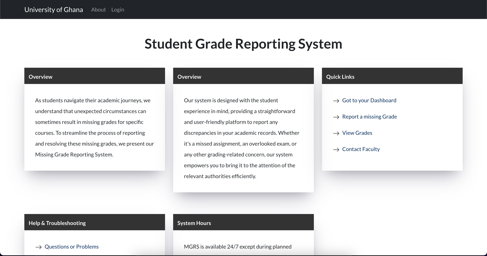

# Student Grade Reporting System Frontend


## Project Overview

This project is a front-end web application for a Student Grade Reporting System. It simulates a real-world application where students can view, report, and manage their academic grades. This system addresses the issue of missing or unrecorded grades in a student's profile.

## Application Structure

The application consists of 7 main pages:

- **Homepage:** Introduction to the system and its purpose.
- **Login Page:** Mock login interface for student authentication.
- **Dashboard:** Displays an overview of the student’s current grades and alerts for missing grades.
- **Grade Report:** Shows a detailed view of the student's grades filtered by semester or academic year.
- **Missing Grade Form:** Enables students to report missing grades.
- **Instructor Contact Page:** Lists instructors' contact information with a simulated email feature.
- **Help and Support:** Provides FAQs and a mock support contact form.

## Technical Details

- **Framework/Technology Used:** [React]
- **Responsive Design:** Implemented using [CSS Flexbox/Grid, Bootstrap].
- **JavaScript Functionality:** Used for form validations, dynamic content rendering, and simulating interactions.

## Setup and Installation

To set up the project locally, follow these steps:

```bash
git clone https://github.com/your-github-username/DCIT_205_ASSIGNGMENT1.git
cd repo-name
npm install
npm start
```

This will start the application on `localhost` at the default port: **[3000]**.

## Alternative Setup, Installation, Deployment and Packaging

### Docker
Ensure that __[Docker](https://www.docker.com/)__ is installed on the host machine and the follow the steps below to start up the application 

### Step 1: Build the Docker 
Open the project folder in the terminal. Make sure you are in the directory where the **Dockerfile** is located. In this case the project root directory. Run the following command to build the Docker image:
```bash
      docker build -t your-react-app .
```
Replace ```your-react-app``` with a suitable name for your Docker Image.

### Step2: Run the Docker Container
After the image is built, you can ran the Docker container using the following command:
```bash
   docker run -p 3000:3000 -d your-react-app
```
Replace ```your-react-app``` with the name you gave to your Docker Image

Now your React application should be accessible at ```http://localhost:3000/``` in your browser.

### Stop Docker container
* List all running containers by running the command ```docker ps```
* Identify the container you want to stop and copy the container ID 
* Run the command ```docker stop ``` followed by the container ID. Eg. ``` docker stop [container_id or name ]```


## Usage
Our application allows students to view their grades, report any missing grades, view thier course history over time and contact instructors regarding any issues. The application also provides the feature of contact IT service for support if incase the application is down or experiencing some lantency. For students to view grades or submit a missing grade request, they must be signed in to do so. This ensures that the requests submitted by the students are tracked in a user session. There is not real backed to track user session for this project scope, however I did simulate an authentication user session process by utilizing the browser's localstorage feature to keep track of user's information.

```To authenticate user, use the following studentID and Password/PIN to login into the application.
* Student ID: 11076489
* Password/PIN: 12345
```

## Testing
For testing the application, __[Enzyme](https://airbnb.io/enzyme/)__ was used for the client React application. The following is an example of testing a basic component:

```javascript
   describe("Rendering Error alert", () => {
  it("Renders Error without crashing", () => {
    const div = document.createElement("div");

    ReactDOM.render(<Error />, div);
    ReactDOM.unmountComponentAtNode(div);
  });
});
```
The component is tested to make sure it can rendered properly and without any errors.