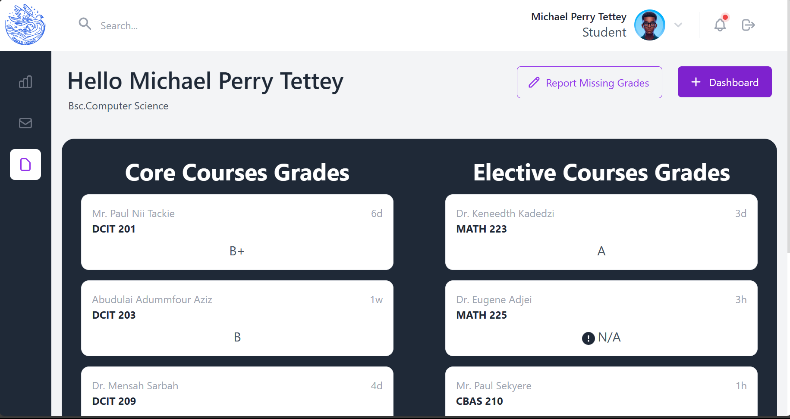

BAYOR DENIS BAGRESOLZU, 11252482_DCIT205_ASSIGNMENT_1 

<b>Missing Grade Reporting System</b> 
This project is a responsive 7-page website designed to serve as a front-end for a "Missing Grade Reporting System," aimed at aiding students in tracking and reporting grades not recorded in their academic profiles. Developed using React, CSS, Bootstrap, or Tailwind, the system includes the following key features:

<b>Landing Page:</b> Provides an overview of the system with navigation links to other pages.

<b>Login Page:</b> Offers a secure login form for students, simulating authentication without a real backend.

<b>Dashboard Page:</b> Displays an overview of the student's current grades and alerts for any missing grades.

<b>Grade Report Page:<b> Allows a detailed view of all courses and grades, with filtering options by semester or academic year.

<b>Missing Grade Form Page:</b> Features a form to report a missing grade, including course details and an explanation field. A simulated confirmation message is displayed upon submission.

<b>Instructor Contact Page:</b> Lists instructors with contact details and provides an option for simulated email communication.

<b>Help and Support Page:</b> Includes a FAQ section on grade reporting and a mock-up contact form for technical support.

The website incorporates a responsive navbar/sidebar and a footer for seamless navigation. Developers can choose between CSS, Bootstrap, or Tailwind for styling.

# Screenshots of the website

## Landing Page

## Dashboard

## Grade Report

## Missing Grade Form

## Instructor Contact

## Help and Support

## Log In

