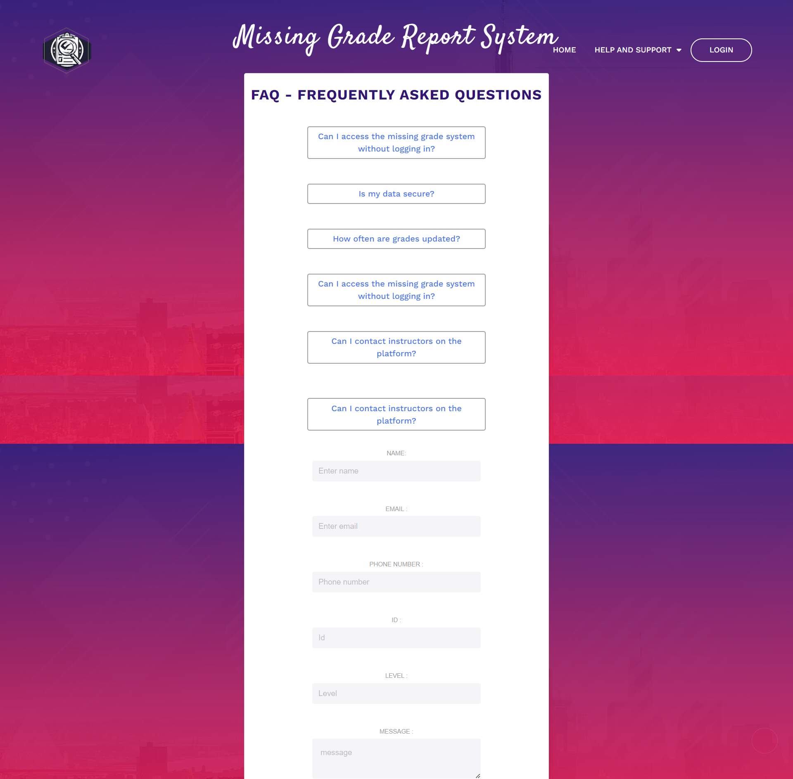

# Student Grade Reporting System Frontend

## Project Overview

This project is a front-end web application for a Student Grade Reporting System. It simulates a real-world application where students can view, report, and manage their academic grades. This system addresses the issue of missing or unrecorded grades in a student's profile.

## Application Structure

The application consists of 7 main pages:

- **Homepage:** Introduction to the system and its purpose.


- **Login Page:** Mock login interface for student authentication.


- **Dashboard:** Displays an overview of the student’s current grades and alerts for missing grades.


- **Grade Report:** Shows a detailed view of the student's grades filtered by semester or academic year.


- **Missing Grade Form:** Enables students to report missing grades.


- **Instructor Contact Page:** Lists instructors' contact information with a simulated email feature.


- **Help and Support:** Provides FAQs and a mock support contact form.



## Technical Details

- **Framework/Technology Used:** [React]
- **Responsive Design:** Implemented using [CSS Flexbox/Grid, Bootstrap, Tailwind CSS].
- **JavaScript Functionality:** Used for form validations, dynamic content rendering, and simulating interactions.

## Setup and Installation

To set up the project locally, follow these steps:

```bash
git clone https://github.com/your-github-username/DCIT_205_ASSIGNGMENT1.git
cd repo-name
npm install
npm start
```

This will start the application on `localhost` at the default port.

## Usage

Describe how to use the application, highlighting key functionalities such as logging in, viewing grades, reporting missing grades, and contacting instructors.

**Logging In:**

Logging into the Student Grade Reporting System is straightforward. Follow these steps:

1. From the Landing Page or the Help and Support Page, click the "Login" button.
2. You will be redirected to the Login Page.
3. Provide your Student ID and PIN for authentication.
4. If your information is verified in the database, you will be granted access to the website.

### Application Functionalities

Once logged in, you can explore the following key functionalities:

- **Dashboard:**
  - View an overview of your current grades.
  - Receive alerts for any missing grades.

- **Grade Report:**
  - Access a detailed view of your grades.
  - Filter grades by semester or academic year.

- **Missing Grade Form:**
  - Report any missing grades by filling out the provided form.
  - Submit the form for confirmation (no actual submission, just a confirmation message).

- **Instructor Contact Page:**
  - Browse a list of instructors with their contact details.
  - Simulate sending emails to instructors (no real emails, just a mock-up).

## Contribution

To contribute to this project, please follow these guidelines:

1. Fork the repository.
2. Create a new branch for your feature.
3. Commit your changes and push them to your branch.
4. Submit a pull request for review.

Please adhere to the project's coding standards and provide clear and detailed pull request descriptions.
