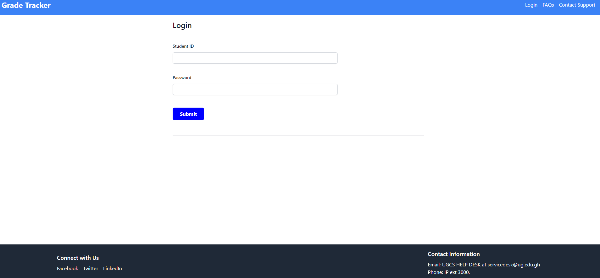

# Missing  Grade Reporting System Frontend

The Missing Grade Reporting System is an exceptional platform that confidently empowers students to manage their academic progress. The system ensures complete transparency, seamless communication, and proactive resolution of any grade-related concerns.

## Project Overview

The project at hand is a comprehensive front-end web application that has been developed to serve as a reliable Student Missing Grade Reporting System. This application has been designed to accurately simulate a real-world scenario where students can easily view, report, and manage their academic grades, as well as get in touch with their respective course instructors if the need arises for any kind of assistance. 


## Application Structure

The application consists of 7 main pages:

- **Landing Page:** Introduction to the system and its purpose.
- **Login Page:** Mock login interface for student authentication.
- **Dashboard:** Displays an overview of the student’s current grades and alerts for missing grades.
- **Grade Report:** Shows a detailed view of the student's grades filtered by semester or academic year.
- **Missing Grade Form:** Enables students to report missing grades.
- **Instructor Contact Page:** Lists instructors' contact information with a simulated email feature.
- **Help and Support:** Provides FAQs and a mock support contact form.

## Technical Details

- **Framework/Technology Used:** [React, CSS, Tailwind>]
- **Responsive Design:** Implemented using [ Tailwind CSS].
- **JavaScript Functionality:** Used for form validations, dynamic content rendering, and simulating interactions.

## Setup and Installation

To set up the project locally, follow these steps:

```bash
git clone https://github.com/ElikplimD/11071863_DCIT205_Assignment-1.git
cd  11071863_DCIT205_Assignment-1
npm install
npm start
```

This will start the application on `localhost 3000` at the default port.

## Usage
To run the project, use the following command
```bash
npm start
```
1. Logging in
Upon opening the landing page, click "Get Started" button to access the the log in page. 
Enter the student ID (e.g., "11071863") and password (e.g., "password"). The Student ID acceptsonly integers but password accepts both leters and numbers.




3. Dashboard
After logging in, you will be directed to the dashboard where you can see your grade report card and any missing grades that need reporting.


5. Report Missing grades
Click 'Report Missing Grades' from dashboard to navigate to the form where you can input your course code, description, expected grade and instructor name and finally submit the report.


7. Grade Report


8. Contacting Instructors
Click on the 'Contact Instructors' button from the dashboard to reach the contact page. Click on any of the emails provided to send a message. 


8. The FAQs/ Help and Support 
Provides answers to questions student ask with regards to issues concerning missing grades and a form to contact the technical support team.


9. Footer
The footer contains links to social media platforms such as Facebook, Twitter and LinkedIn as well as the contact information of the School's official helpdesk (UGCS helpdesk)

## Test codes
Test codes were written to test the functionality of the button, navbar and footer


## Contribution

To contribute to this project, please follow these guidelines:

1. Fork the repository.
2. Create a new branch for your feature : `git checkout -b feature-name`
3. Make your changes
4. Commit your changes and push them to your branch : `git push origin feature-name`
5. Submit a pull request for review.

Please adhere to the project's coding standards and provide clear and detailed pull request descriptions.

## License
This project is licensed under the [MIT License](LICENSE). 

## Conclusion

The Student Missing Grade Reporting System is an essential tool that addresses the common issue of missing or unrecorded grades in a student's academic profile. With this application, students can now promptly report any missing grades they come across in their profiles, and the system will take the necessary steps to rectify the issue. 

Furthermore, this web application has a user-friendly interface that makes it easy for students to navigate and use the system with ease. It is a reliable and efficient tool that helps students keep track of their academic progress, ensuring that they get the recognition they deserve for their hard work and dedication. Happy Exploring !
